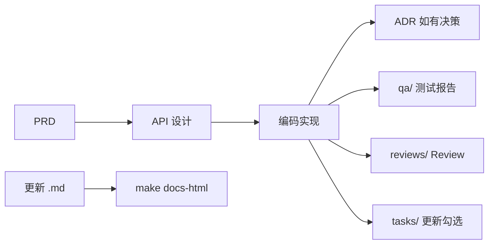

# CRM 项目文档

**版本**：v0.3  
**更新**：2026-05-21

> **浏览器入口**：[index.html](./index.html)（推荐）  
> **构建 HTML**：在项目根目录执行 `make docs-html`

本目录是 EnterpriseFlow CRM 的**单一文档入口**。

---

## 快速导航

| 我要… | Markdown | HTML 预览 |
|--------|----------|-----------|
| 文档首页 | [README.md](./README.md) | [index.html](./index.html) |
| 产品范围与角色 | [prd/00-crm-overview.md](./prd/00-crm-overview.md) | [prd/00-crm-overview.html](./prd/00-crm-overview.html) |
| MVP 任务进度 | [tasks/00-mvp-task-breakdown.md](./tasks/00-mvp-task-breakdown.md) | [tasks/00-mvp-task-breakdown.html](./tasks/00-mvp-task-breakdown.html) |
| 阶段 / 会议笔记 | [meeting-notes/README.md](./meeting-notes/README.md) | [meeting-notes/README.html](./meeting-notes/README.html) |
| QA 测试报告 | [qa/README.md](./qa/README.md) | [qa/README.html](./qa/README.html) |
| Code Review | [reviews/README.md](./reviews/README.md) | [reviews/README.html](./reviews/README.html) |
| API 契约 | [api/00-api-design.md](./api/00-api-design.md) | [api/00-api-design.html](./api/00-api-design.html) |
| 系统架构 | [architecture/00-main-architecture.md](./architecture/00-main-architecture.md) | [architecture/00-main-architecture.html](./architecture/00-main-architecture.html) |
| 架构决策 ADR | [architecture/adr/README.md](./architecture/adr/README.md) | [architecture/adr/README.html](./architecture/adr/README.html) |
| 数据库 Schema | [backend-arch/00-database-schema.md](./backend-arch/00-database-schema.md) | [backend-arch/00-database-schema.html](./backend-arch/00-database-schema.html) |

---

## 目录结构

```
docs/
├── README.md / index.html      # 文档入口
├── prd/                        # 产品需求 → prd/README.md
├── api/                        # API 契约 → api/README.md
├── architecture/               # 系统架构 → architecture/README.md
│   └── adr/                    # 架构决策记录
├── backend-arch/               # 后端约定 → backend-arch/README.md
├── frontend-arch/              # 前端约定 → frontend-arch/README.md
├── tasks/                      # 任务进度（仅勾选）→ tasks/README.md
├── meeting-notes/              # 阶段/会议笔记 → meeting-notes/README.md
├── qa/                         # QA 测试报告 → qa/README.md
├── reviews/                    # Code Review 记录 → reviews/README.md
└── templates/                  # 文档空模板
```

---

## 文档类型与职责

| 类型 | 目录 | 回答的问题 | 何时更新 |
|------|------|------------|----------|
| **PRD** | `prd/` | 做什么、验收标准 | 新模块开发前 |
| **API** | `api/` | 接口契约 | 与 PRD 同步，编码前 |
| **Architecture** | `architecture/` | 系统如何组织 | 架构变更时 |
| **ADR** | `architecture/adr/` | 为什么这样选 | 有取舍的决策后 1–2 天 |
| **Tasks** | `tasks/` | 进度勾选 | 每个 Phase 开始/结束 |
| **Meeting Notes** | `meeting-notes/` | 验收、阻塞、联调记录 | Phase/会议结束后 |
| **QA** | `qa/` | 测了什么、通没通 | 阶段/模块测试完成后 |
| **Reviews** | `reviews/` | Review 过没过 | Code Review 结束后 |
| **Backend Arch** | `backend-arch/` | Schema、分层 | 脚手架/规范变更 |
| **Frontend Arch** | `frontend-arch/` | 目录、状态管理 | 前端规范变更 |

---

## MD + HTML 双格式规范

与 `.cursorrules` 一致：

1. **源码**：`.md` 文件纳入 Git，供 Cursor / 协作编辑  
2. **预览**：同名 `.html`，由构建脚本生成，勿手改  
3. **更新流程**：改 `.md` → 运行 `make docs-html` → 提交 `.md` + `.html`

```bash
# 首次
cd scripts/doc-tools && npm install
cd ../.. && make docs-html

# 打开浏览器
open docs/index.html
```

HTML 特性：侧边栏导航、代码高亮、Mermaid 渲染、明暗主题切换。

---

## 推荐工作流



1. Product → PRD  
2. Architect → 架构 / ADR  
3. Dev → 按 API 实现 + 自动化测试  
4. QA → `docs/qa/{phase|模块}-qa.md`  
5. Review → `docs/reviews/{phase|模块}-review.md`  
6. 全员 → 勾选 `tasks/`，笔记写 `meeting-notes/` 并链到 QA/Review  
7. `make docs-html`

---

## 当前进度

| Phase | 状态 | 说明 |
|-------|------|------|
| Phase 0 基础架构 | ✅ 已完成 | [tasks/00-mvp-task-breakdown.md](./tasks/00-mvp-task-breakdown.md) |
| Phase 1 认证权限 | 🔲 进行中 | 登录 / Refresh / 多租户切换 |
| Phase 2–4 | 🔲 未开始 | — |

---

## 代码入口

| 端 | 路径 |
|----|------|
| Backend | [../backend/README.md](../backend/README.md) |
| Frontend 应用 | [../apps/web/README.md](../apps/web/README.md) |
| UI Kit 组件库 | [../packages/ui-kit/README.md](../packages/ui-kit/README.md) |
