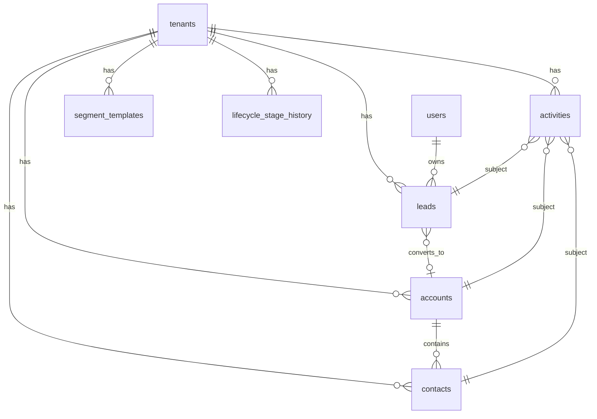

# Phase 2 数据模型与迁移纲要

**版本**：v1.0  
**日期**：2026-05-22  
**关联**：[phase-2-crm-ai.md](../api/phase-2-crm-ai.md) · [phase-2-relationship-crm-prd.md](../prd/phase-2-relationship-crm-prd.md)

---

## 1. ER 概览



---

## 2. 新表

### 2.1 `accounts`

| 列 | 类型 | 约束 |
|----|------|------|
| id | UUID PK | |
| tenant_id | UUID FK | NOT NULL |
| owner_id | UUID FK users | NULL |
| name | VARCHAR(255) | NOT NULL |
| industry | VARCHAR(100) | |
| website | TEXT | |
| lifecycle_stage | VARCHAR(32) | DEFAULT `acquire` |
| engagement_score | SMALLINT | DEFAULT 0 |
| last_activity_at | TIMESTAMPTZ | |
| tags | TEXT[] | DEFAULT `{}` |
| created_by / updated_by | UUID | |
| timestamps + deleted_at | | 软删 |

索引：`(tenant_id)`, `(tenant_id, owner_id)`, `(tenant_id, lifecycle_stage)`

### 2.2 `contacts`

| 列 | 类型 | 约束 |
|----|------|------|
| id | UUID PK | |
| tenant_id | UUID FK | NOT NULL |
| account_id | UUID FK accounts | NULL |
| owner_id | UUID FK | |
| first_name / last_name | VARCHAR(100) | |
| email | VARCHAR(255) | |
| phone | VARCHAR(50) | |
| is_primary | BOOLEAN | DEFAULT false |
| lifecycle_stage | VARCHAR(32) | |
| engagement_score | SMALLINT | |
| last_activity_at | TIMESTAMPTZ | |
| tags | TEXT[] | |
| timestamps + deleted_at | | |

索引：`(tenant_id, account_id)`, `(tenant_id, email)`

### 2.3 `activities`

| 列 | 类型 | 约束 |
|----|------|------|
| id | UUID PK | |
| tenant_id | UUID FK | NOT NULL |
| subject_type | VARCHAR(20) | NOT NULL |
| subject_id | UUID | NOT NULL |
| event_type | VARCHAR(32) | NOT NULL |
| direction | VARCHAR(16) | |
| body | TEXT | |
| metadata | JSONB | DEFAULT `{}` |
| sentiment | VARCHAR(20) | |
| sentiment_source | VARCHAR(16) | |
| occurred_at | TIMESTAMPTZ | NOT NULL |
| created_by | UUID FK users | |
| timestamps + deleted_at | | |

索引：`(tenant_id, subject_type, subject_id, occurred_at DESC)`

### 2.4 `segment_templates`

| 列 | 类型 | 说明 |
|----|------|------|
| id | UUID PK | |
| tenant_id | UUID | NULL = 系统预置复制到租户 |
| code | VARCHAR(50) | 唯一 per tenant |
| name_i18n_key | VARCHAR(100) | |
| filter_json | JSONB | 筛选 DSL（见下） |
| is_system | BOOLEAN | 预置不可删 |

**filter_json 示例**（`churn_risk`）：

```json
{ "and": [{ "field": "days_since_last_activity", "op": "gt", "value": 7 }] }
```

### 2.5 `lifecycle_stage_history`（可选，建议 Phase 2 做）

| 列 | 类型 | 说明 |
|----|------|------|
| subject_type / subject_id | | |
| from_stage / to_stage | | |
| changed_by | UUID | |
| created_at | | 供 emotion-journey `lifecycle_bands` |

---

## 3. `leads` 表变更（迁移 `00006_phase2_crm.sql`）

```sql
ALTER TABLE leads
  ADD COLUMN IF NOT EXISTS lifecycle_stage VARCHAR(32) DEFAULT 'acquire',
  ADD COLUMN IF NOT EXISTS engagement_score SMALLINT DEFAULT 0,
  ADD COLUMN IF NOT EXISTS last_activity_at TIMESTAMPTZ,
  ADD COLUMN IF NOT EXISTS tags TEXT[] DEFAULT '{}',
  ADD COLUMN IF NOT EXISTS relationship_health VARCHAR(16),
  ADD COLUMN IF NOT EXISTS converted_account_id UUID REFERENCES accounts(id),
  ADD COLUMN IF NOT EXISTS converted_contact_id UUID REFERENCES contacts(id);
```

---

## 4. 计算字段策略

| 字段 | 更新时机 |
|------|----------|
| `last_activity_at` | Activity INSERT/UPDATE（`occurred_at` 最大） |
| `engagement_score` | Activity 或 status/lifecycle 变更后 Service 重算（规则 § PRD 4.3.4） |
| `relationship_health` | 由 `engagement_score` 分段：≥70 high，40–69 medium，<40 low |

**禁止** FE 写入 `engagement_score` / `relationship_health`。

---

## 5. 租户 config 与种子

`tenants.config` 已有 JSONB。Phase 2 种子：

```json
{
  "ai_enabled": false,
  "ai_preview_mode": "off",
  "insight_thresholds": { "days_silent": 7, "high_value_amount": 100000 },
  "sentiment_keyword_rules": []
}
```

演示租户 `preview`：`ai_enabled: true`, `ai_preview_mode: "fixtures"`。

---

## 6. 迁移文件规划

| 文件 | 内容 |
|------|------|
| `00006_phase2_crm.sql` | accounts, contacts, activities, segment_templates, leads ALTER, 新 permissions |
| `00007_seed_phase2_segments.sql` | 5 个预置分群 per tenant（或注册时复制） |
| `00008_seed_preview_tenant.sql` | demo@preview.crm + 样例 leads/activities（仅 dev） |

---

## 7. 索引与性能

- 列表页：`(tenant_id, deleted_at, updated_at DESC)`  
- 洞察求值：批量查询主体最近 Activity（LIMIT 50）  
- 情绪旅程：单次查询 activities + lifecycle_history，避免 N+1  

目标：详情时间线 P95 < 500ms（50 条内，PRD §7）。

---

## 8. 修订记录

| 日期 | 说明 |
|------|------|
| 2026-05-22 | v1.0 首版 |
