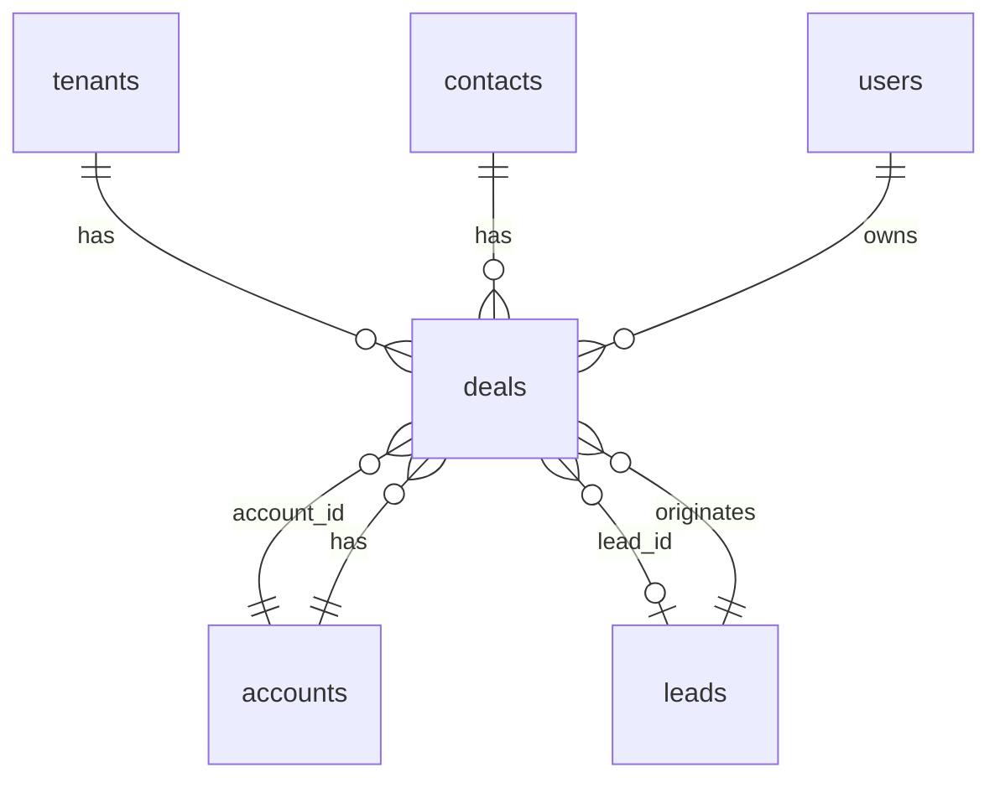

# Phase 3 数据模型与迁移纲要 — Deals + Dashboard

**版本**：v1.0  
**日期**：2026-05-24  
**关联**：[phase-3-deals-dashboard-api.md](../api/phase-3-deals-dashboard-api.md) · [00-crm-overview.md](../prd/00-crm-overview.md) §Phase 3

---

## 1. ER 扩展



---

## 2. 新表 `deals`

| 列 | 类型 | 约束 |
|----|------|------|
| id | UUID PK | |
| tenant_id | UUID FK | NOT NULL |
| owner_id | UUID FK users | NULL |
| title | VARCHAR(255) | NOT NULL |
| stage | VARCHAR(32) | NOT NULL DEFAULT `qualification` |
| amount | DECIMAL(18,2) | DEFAULT 0 |
| currency | VARCHAR(8) | DEFAULT `CNY` |
| probability | SMALLINT | DEFAULT 0 CHECK 0–100 |
| expected_close_date | DATE | |
| account_id | UUID FK accounts | NULL |
| lead_id | UUID FK leads | NULL |
| contact_id | UUID FK contacts | NULL |
| description | TEXT | |
| lost_reason | VARCHAR(500) | |
| closed_at | TIMESTAMPTZ | won/lost 时写入 |
| engagement_score | SMALLINT | DEFAULT 0（可选，规则同 Phase 2） |
| last_activity_at | TIMESTAMPTZ | |
| tags | TEXT[] | DEFAULT `{}` |
| created_by / updated_by | UUID | |
| created_at / updated_at / deleted_at | | 软删 |

**索引**

- `(tenant_id, owner_id)`
- `(tenant_id, stage)`
- `(tenant_id, account_id)`
- `(tenant_id, expected_close_date)`
- `(tenant_id, updated_at DESC)` — Pipeline 排序

**CHECK**

- `stage IN ('qualification','proposal','negotiation','won','lost')`

---

## 3. 租户配置扩展

写入 `tenants.config` JSONB（与 Phase 2 `ai_*` 并列）：

| 键 | 类型 | 默认 | 说明 |
|----|------|------|------|
| `sales_quota` | object | `{ "amount": 0, "period": "month" }` | Dashboard 配额 Gauge |
| `pipeline_display_metric` | string | `count` | `count` \| `amount` |

示例：

```json
{
  "sales_quota": { "amount": 5000000, "currency": "CNY", "period": "2026-05" },
  "pipeline_display_metric": "amount"
}
```

---

## 4. 可选表（Phase 3 可不建）

### 4.1 `deal_stage_history`

| 列 | 类型 | 说明 |
|----|------|------|
| deal_id | UUID FK | |
| from_stage / to_stage | VARCHAR(32) | |
| changed_by | UUID | |
| created_at | TIMESTAMPTZ | |

用于阶段停留天数统计（`stats/velocity`）；MVP 可用 `audit_logs` 代替。

---

## 5. 迁移计划

| 文件 | 内容 |
|------|------|
| `00010_phase3_deals.sql` | `deals` 表 + 索引 |
| `00011_seed_phase3_dashboard_permission.sql` | `dashboard:view`；角色绑定 |
| `00012_seed_phase3_deals_demo.sql` | Demo 租户 3–5 条商机（可选，与 Pipeline 演示） |

**回滚**：`DROP TABLE deals`；删除 permissions 行。

---

## 6. 与代码落点

| 层 | 路径 |
|----|------|
| Domain | `internal/domain/deal.go` |
| Repository | `internal/repository/deal_repository.go` |
| Service | `internal/application/deal/service.go` |
| Dashboard | `internal/application/dashboard/summary.go` |
| HTTP | `internal/interfaces/http/deals.go`、`dashboard.go` |

---

## 7. 修订记录

| 日期 | 说明 |
|------|------|
| 2026-05-24 | v1.0：架构师 3.0，对齐 phase-3-deals-dashboard-api v1.0 |
