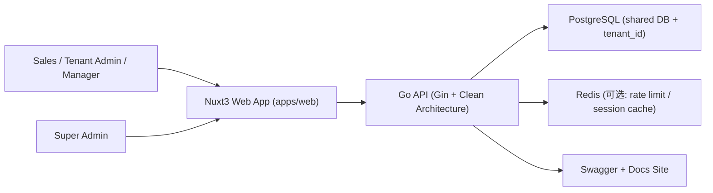

# Phase 4 架构设计：系统设置与收尾

**版本**：v1.0  
**日期**：2026-05-26  
**状态**：Accepted（Architect 2a 基线）  
**输入**：[phase-4-system-settings-close-prd.md](../prd/phase-4-system-settings-close-prd.md) · [phase-4-system-settings-api.md](../api/phase-4-system-settings-api.md)

---

## 1. 系统上下文图（C4 Level 1）

Phase 4 在既有 CRM 链路上新增 Settings 与运营可视化能力，不引入新运行时组件。

---

## 2. 技术选型与边界

| 层 | 选型 | 理由 |
|----|------|------|
| 前端 | Nuxt 3 + TypeScript + Pinia | 已在 Phase 0–3 稳定使用；SSR/CSR 混合、i18n 能力成熟 |
| 后端 | Go + Gin + Clean Architecture | 低延迟、易并发，便于按模块拆分 service/repository |
| 数据库 | PostgreSQL | JSONB + 索引能力适合 tenant config/custom fields |
| 权限 | Casbin (`resource:action`) | 与既有 RBAC 模型一致，新增资源成本低 |
| 认证 | JWT + Refresh Token | 现有认证体系可复用，多租户上下文清晰 |
| 图表 | `@crm/ui-kit` Chart* + Theme bridge | 保持双包模型与视觉一致性 |

---

## 3. 多租户实现方案

## 3.1 隔离策略

- 继续采用 **共享库 + `tenant_id`**（ADR-0001 已采纳）。
- 所有 Phase 4 业务表（`tenant_settings` / `custom_fields` / `audit_logs` 聚合查询）必须带 `tenant_id` 过滤。
- Super Admin 跨租户统计走独立路由组，不经过租户中间件，但要求 `is_super_admin=true`。

## 3.2 数据访问约束

| 规则 | 要求 |
|------|------|
| 请求体 | 禁止传 `tenant_id` |
| Context 来源 | 仅从 JWT + `X-Tenant-ID` 注入 |
| 越权返回 | 跨租户资源统一 `404`（防枚举） |
| 查询路径 | Repository 层必须接收 `tenantID` 参数 |

---

## 4. RBAC 权限模型设计

## 4.1 角色

| 角色 | 数据范围 | Phase 4 关键能力 |
|------|----------|------------------|
| `tenant_admin` | 本租户 all | settings/custom fields/audit export |
| `manager` | 本租户（视 data_scope） | audit view、运营图查看 |
| `sales` | 本租户 self | 仅查看与其权限一致的数据 |
| `viewer` | 本租户只读 | 禁止配置变更与导出 |
| `super_admin` | 跨租户 | 平台级健康度与套餐分析 |

## 4.2 资源动作

| resource | actions |
|----------|---------|
| `settings` | `view`, `update` |
| `custom_fields` | `view`, `update` |
| `audit` | `view`, `export` |
| `admin_tenant_insights` | `view` |

---

## 5. 认证授权方案

- 继续沿用 `access_token + refresh_token`。
- `access_token` 载荷包含：`user_id`, `tenant_id`, `role_ids`, `is_super_admin`。
- 普通租户接口：
  - 必须 `Authorization` + `X-Tenant-ID`。
  - 中间件校验 token 中 `tenant_id` 与 header 一致。
- Super Admin 接口：
  - 仅 `Authorization`，忽略 `X-Tenant-ID`。
  - 中间件校验 `is_super_admin`。

---

## 6. 数据库设计原则（PostgreSQL）

## 6.1 表与字段策略

| 模块 | 设计原则 |
|------|----------|
| 租户配置 | 低频写高频读，优先单行配置 + JSONB 扩展 |
| 自定义字段 | 元数据与业务值分离，先支持 text/select/date |
| 审计聚合 | 基于 `audit_logs` 聚合，避免冗余统计表 |
| 健康度 | 优先实时聚合；压力升高后再引入物化视图 |

## 6.2 索引建议

- `custom_fields(tenant_id, entity_type, is_active, display_order)`
- `audit_logs(tenant_id, action, created_at DESC)`
- `audit_logs(tenant_id, actor_id, created_at DESC)`
- `tenants(plan, is_active)`（super admin 聚合）

---

## 7. 前端 2b 切面（路由/信息流/组件）

## 7.1 路由与页面职责

| 路由 | 角色 | 页面职责 |
|------|------|----------|
| `/settings` | tenant_admin | 租户设置 + 自定义字段管理 |
| `/settings/audit` | tenant_admin / manager | 审计图表与导出 |
| `/admin` | super_admin | 健康度雷达、套餐分布、租户 TOP |

## 7.2 数据流

`API` -> `composables/use-settings|use-custom-fields|use-audit-stats|use-admin-tenant-insights` -> `feature/settings|feature/admin` -> `@crm/ui-kit` (`ChartRadar`, `ChartDonut`, `ChartBar`)

约束：

- 业务校验与权限前置在 composable，不堆在页面。
- `Pinia` 仅存跨页共享（如当前租户基础配置快照）。
- web 禁止 deep import ui-kit 内部实现，统一从 `@crm/ui-kit` 暴露层引用。

## 7.3 组件落点

| 类型 | 路径 |
|------|------|
| 业务组件 | `apps/web/components/feature/settings/*` |
| composables | `apps/web/composables/use-*.ts` |
| 图表组件 | `packages/ui-kit/src/components/ui/chart/*` |
| 管理端页面 | `apps/web/pages/admin.vue`（或拆分 `admin/*`） |

---

## 8. i18n 架构

- 文案 key 分层：
  - `settings.*`
  - `audit.*`
  - `admin.tenantInsights.*`
- 自定义字段 `field_label` 支持 `{ "zh-CN", "en-US" }` 双语对象。
- 时间/数字格式化按 `locale + tenant.timezone`。
- CI 增量检查：禁止在 Phase 4 页面硬编码中英文字符串（测试/fixture 除外）。

---

## 9. 可扩展性与安全

## 9.1 可扩展性

- `custom_fields.field_type` 采用枚举 + 验证器映射，后续可扩展到 `number`, `multi_select`, `lookup`。
- 健康度维度采用固定枚举 + 权重配置，后续支持租户分层权重模板。
- 审计导出先 CSV，后续可追加异步导出（任务队列 + 下载链接）。

## 9.2 安全

- 防 IDOR：所有资源查询必须先过滤 `tenant_id` 再按 `id`。
- 导出限频：`audit/export` 按用户 + 租户限流。
- 敏感审计脱敏：`before/after` 仅保留差异摘要，不回传敏感值。
- 配置变更必须写审计，记录操作者、来源 IP、UA（按现有审计模型能力）。

---

## 10. 实施建议与门禁

| 门禁 | 说明 |
|------|------|
| API 契约 | `phase-4-system-settings-api.md` 评审通过 |
| FE 切面 | 路由/composable/组件落点已冻结 |
| 权限种子 | 新资源动作已写迁移 |
| 自动化测试 | BE（租户+RBAC+审计）/FE（composable+组件）/QA（E2E 核心链路） |

---

## 11. 修订记录

| 日期 | 说明 |
|------|------|
| 2026-05-26 | v1.0：Phase 4 架构基线，覆盖多租户/RBAC/i18n/security/前端切面 |
