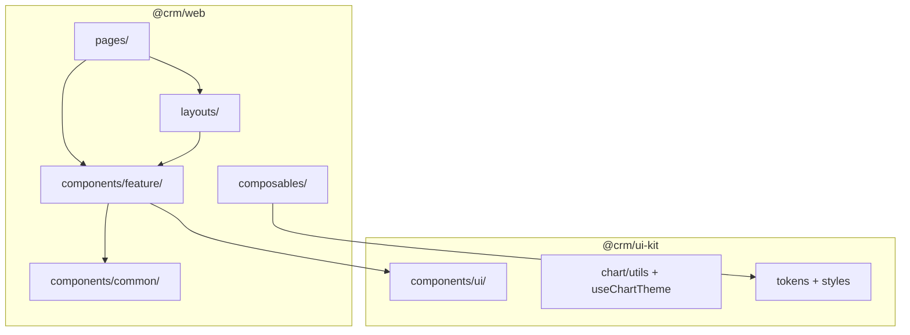
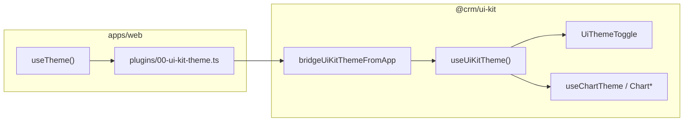

# UI Kit 模块与组件模型

**版本**：v2.1 · `@crm/ui-kit` + `@crm/web`（pnpm workspace）

> 早期「`frontend/components` 五层（base / ui / common / layout / feature）」已废止。  
> 设计系统 → **`packages/ui-kit`**；CRM 业务 UI → **`apps/web/components`**。

---

## 1. Monorepo 结构

```
crm/
├── pnpm-workspace.yaml
├── package.json                 # pnpm dev / build / test
├── apps/
│   └── web/                     # @crm/web
├── packages/
│   └── ui-kit/                  # @crm/ui-kit（可发布）
└── e2e/
```

| 包名 | 路径 | 职责 | 发布 |
|------|------|------|------|
| `@crm/web` | `apps/web` | 路由、feature、RBAC、多租户、i18n | ❌ |
| `@crm/ui-kit` | `packages/ui-kit` | Token/CSS、Chart*、Card*、`UiThemeToggle` | ✅ |

> 旧目录 `frontend/` 已删除。根目录 `pnpm dev`（单实例），以终端 **Local:** URL 为准。

### 1.1 路由与基础 UI 库

| 项 | 约定 |
|----|------|
| 路由 | **HTML5 History**；`apps/web/nuxt.config.ts` 保持 `router.options.hashMode: false`，禁止 `#/` hash 深链 |
| 基础 UI | **Element Plus / PrimeVue / @nuxt/ui 择一**（ADR 可定）；`@crm/ui-kit` 对其做二次封装（token、主题、动效），业务页不裸用库组件、不手写 Button/Input/Table/Dialog |



---

## 2. `@crm/ui-kit` 目录与组件

```
packages/ui-kit/
├── src/
│   ├── index.ts
│   ├── tokens/
│   ├── theme/context.ts、bridge.ts
│   ├── styles/design-system.css
│   ├── chart/                   # types、use-chart-theme、utils/
│   ├── components/ui/
│   │   ├── theme-toggle.vue
│   │   ├── card/                # CardMetric、CardShell
│   │   └── chart/*.vue
│   ├── nuxt/module.ts
│   └── runtime/echarts.client.ts
├── tailwind.preset.ts
├── tests/
└── package.json                 # exports → dist/
```

由 `@crm/ui-kit/nuxt` 注册，**勿**在 `apps/web/components` 重复实现。

| 目录 | 标签 | 职责 |
|------|------|------|
| `components/ui/theme-toggle.vue` | `<UiThemeToggle />` | 主题切换（需应用 bridge） |
| `components/ui/card/*` | `<CardMetric />`、`<CardShell />` | 场景 `dashboard` / `content` |
| `components/ui/chart/*` | `<ChartShell />`、`<ChartLine />` 等 | 图表族 |
| `chart/` | — | `useChartTheme`、Vitest utils、对外 types |

```vue
<ChartLine :categories="days" :series="series" loading-text="加载中…" />
```

```ts
import type { ChartSeries } from '@crm/ui-kit'
```

**禁止**：业务页 `useChartTheme`、deep import `packages/ui-kit/src/...`。

---

## 3. `@crm/web` 应用组件

仅 `apps/web/components/`（`nuxt.config` → `components`）：

| 目录 | 前缀 | 职责 | 示例 |
|------|------|------|------|
| `common/` | 无 | 跨 feature，依赖应用 RBAC/租户 | `PermissionGuard` |
| `feature/{domain}/` | `Admin`、`Login` 等 | 单域 UI，**禁止跨域互引** | 侧栏、KPI 区用 `<CardMetric />` |

### 与 `layouts/` 的分工

| 位置 | 用途 |
|------|------|
| `layouts/*.vue` | Nuxt 路由级布局 |
| `feature/*` 内壳层 | 由 layout 组装，不单独维护 `components/layout/` |

**为何 `PermissionGuard` 不在 ui-kit**：依赖 `usePermission()`，不可随设计系统发布。

场景登记：[05-component-scenarios.md](./05-component-scenarios.md)。

---

## 4. 依赖规则

| 从 | 允许 | 禁止 |
|----|------|------|
| `pages/` | `feature/`、`layouts/`、`composables/`、`@crm/ui-kit` | deep import ui-kit 源码 |
| `feature/{a}/` | `common/`、`@crm/ui-kit` | `feature/{b}/`、组件内裸 `fetch` |
| `common/` | `@crm/ui-kit`（按需） | `feature/*` |
| `@crm/ui-kit` | `vue`、`echarts`（peer） | `@crm/web`、业务 API、i18n key |

**逻辑与展示分离**：请求、权限、Zod → `apps/web/composables` / `utils`；ui-kit 只做展示与图表配置。

### 4.1 主题桥接（必须）

Monorepo 分包下，仅靠 `provide` / `inject` 常无法让 ui-kit 读到 `useTheme()`。使用 **模块级 bridge**：

```ts
// apps/web/plugins/00-ui-kit-theme.ts
import { bridgeUiKitThemeFromApp } from '@crm/ui-kit'

export default defineNuxtPlugin(() => {
  bridgeUiKitThemeFromApp(useTheme())
})
```

| 层级 | 职责 |
|------|------|
| `apps/web` | Cookie `crm-theme`、`applyThemeToDocument`、`useTheme()` |
| bridge | `bridgeUiKitThemeFromApp` |
| ui-kit | `useUiKitTheme()` → `UiThemeToggle`、`useChartTheme` / `Chart*` |

- 组件内用 **`useUiKitTheme()`**，勿 `inject` 失败就 `throw`（SSR 500）。
- Token 细节见 [03-design-system.md](./03-design-system.md)；排障见 [§10](#10-常见问题与排障)。



---

## 5. 命名与自动导入

| 包 | 配置 | 前缀 |
|----|------|------|
| ui-kit | `packages/ui-kit/src/nuxt/module.ts` | `Chart*`、`Ui*`、`Card*` |
| web | `apps/web/nuxt.config.ts` → `components` | `Admin*`、`Login*`、`PermissionGuard` |

- 文件名：`kebab-case.vue`
- 文案：应用 `locales/`；ui-kit 用 props（`loading-text`、`format-label`）

---

## 6. Nuxt 集成

```ts
// apps/web/nuxt.config.ts
export default defineNuxtConfig({
  modules: ['@nuxtjs/tailwindcss', '@pinia/nuxt', '@nuxtjs/i18n', '@crm/ui-kit/nuxt'],
  build: { transpile: ['@crm/ui-kit'] },
})
```

---

## 7. 约束、测试与构建

```bash
pnpm --filter @crm/web lint:layers    # apps/web/components 架构测试
pnpm --filter @crm/ui-kit test      # chart utils 单测
pnpm --filter @crm/ui-kit build     # 改 src/ 后必做，产出 dist/
pnpm --filter @crm/web build
make e2e-test                       # 含 charts-theme.spec.ts
```

| 模块 | 命令 | 类型 |
|------|------|------|
| ui-kit chart utils | `pnpm --filter @crm/ui-kit test` | Vitest |
| web | `pnpm --filter @crm/web test`、`lint:layers` | Vitest / 架构 |
| E2E | `make e2e-test` | Playwright |

`apps/web/tests/component-layers.test.ts` 只扫 **web/components**，不替代 ui-kit 单测。

**exports**：`@crm/ui-kit` → `dist/index.js`；`styles.css`；`/nuxt`；`/tokens`。CI 与发布以 **dist** 为准。

---

## 8. ui-kit 演进（CRM Phase）

| CRM Phase | ui-kit / 图表 | 状态 |
|-----------|---------------|------|
| Phase 0 | Chart*、Card*、monorepo、theme bridge | ✅ |
| Phase 1 | Admin `ChartLine` 嵌入 | 待办 |
| Phase 2 | +`ChartDonut`；Leads 报表 | 待办 |
| Phase 3 | +`ChartSparkline`、`ChartGauge`；Dashboard | 待办 |
| Phase 4 | +`ChartRadar`；Storybook + 视觉回归 | 待办 |
| Phase 5+ | Heatmap、Scatter、Sankey 等 | 规划中 |

Phase 交付勾选：[../tasks/00-mvp-task-breakdown.md](../tasks/00-mvp-task-breakdown.md)。

---

## 9. 合并前检查清单

- [ ] 新设计系统组件 → `packages/ui-kit`（非 `apps/web/components/ui`）
- [ ] 新业务组件 → `apps/web/components/feature/{domain}/`
- [ ] 跨 feature + RBAC → `apps/web/components/common/`
- [ ] 页面用 `<Chart*>` / `import type { … } from '@crm/ui-kit'`，不调用 `useChartTheme`
- [ ] 未跨 `feature/{domain}` 互引
- [ ] `lint:layers` + ui-kit `test` 通过；改 ui-kit 后已 `build`

---

## 10. 常见问题与排障 {#10-常见问题与排障}

| # | 问题 |
|---|------|
| [Q1](#q1-charts-v1v2) | `/charts` 点 V1/V2 无反应或 500 |
| [Q2](#q2-inject-not-found) | `injection "crm-ui-kit-theme" not found` |
| [Q3](#q3-bridge-not-function) | `bridgeUiKitThemeFromApp is not a function` |
| [Q4](#q4-dev-port) | dev 端口与 `localhost:3000` 不一致 |
| [Q5](#q5-chart-colors) | 图表颜色不随主题切换 |

### Q1. `/charts` V1/V2 无反应或 500 {#q1-charts-v1v2}

确认 [§4.1](#41-主题桥接必须) 插件、`useUiKitTheme()`；`pnpm --filter @crm/ui-kit build` 后重启 `pnpm dev`。

### Q2. inject not found {#q2-inject-not-found}

用 bridge + `useUiKitTheme()`；勿仅 `app.vue` provide。

### Q3. bridge is not a function {#q3-bridge-not-function}

未 build ui-kit `dist` → `pnpm --filter @crm/ui-kit build`。

### Q4. dev 端口 {#q4-dev-port}

只保留一个根目录 `pnpm dev`；以终端 URL 为准。

### Q5. 图表颜色 {#q5-chart-colors}

bridge 接通 + `useChartTheme` 订阅 `useUiKitTheme().id` + `theme.client.ts` watch（见 [03-design-system.md](./03-design-system.md)）。

---

## 11. 相关文档

- [01-directory-structure.md](./01-directory-structure.md) — 应用目录速览
- [03-design-system.md](./03-design-system.md) — Token、主题
- [04-ux-design-guidelines.md](./04-ux-design-guidelines.md) — UX 与动效
- [05-component-scenarios.md](./05-component-scenarios.md) — Card/Chart 场景
- `packages/ui-kit/README.md`

---

## 12. 修订记录

| 日期 | 说明 |
|------|------|
| 2025-05 | v2.0 双包模型（原 `02-component-layers`） |
| 2025-05 | v1.0 ui-kit 模块（原 `03-ui-kit-modules`） |
| 2026-05-22 | v2.1 合并 02+03；并入原 04-faq 排障 |
| 2026-05-22 | 合并 02+03，定稿为 `02-ui-kit-modules.md` |
