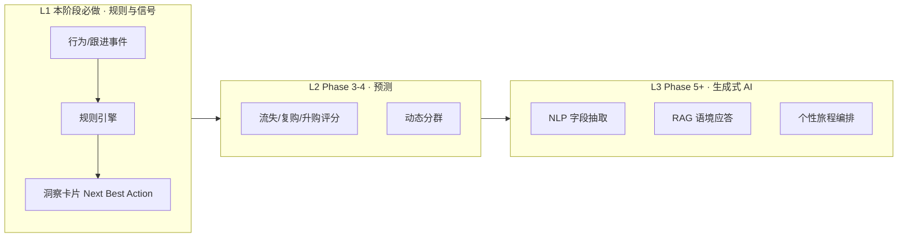
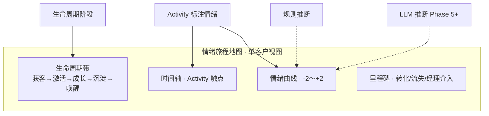

# Phase 2 PRD：从「管理客户」到「经营关系」

**产品名称**：EnterpriseFlow CRM  
**版本**：Phase 2 v0.3（关系经营基座 + **AI Preview 演示壳**）  
**日期**：2026-05-22  
**状态**：待评审（Implementation 开工前必读）  
**MVP 总览**：[00-crm-overview.md](./00-crm-overview.md)（AI 战略与 MoSCoW）  
**依赖**：Phase 0 架构、Phase 1 认证/RBAC/审计（已关闭或有条件关闭）  
**关联任务**：[00-mvp-task-breakdown.md](../tasks/00-mvp-task-breakdown.md) § Phase 2

---

## 0. 执行摘要（给决策者）

Phase 0/1 已解决 **「谁能进系统、能看什么」**。若 Phase 2 仍按传统 CRM 只做 Accounts / Leads 录入，产品将停留在 **「被动存储」**——与参考材料中的 AI/智能 CRM 差距不在「有没有聊天机器人」，而在 **产品范式**：

| 范式问题 | 传统答案 | 本阶段目标答案 |
|----------|----------|----------------|
| 系统是管流程还是养关系？ | 管流程（状态、分配、报表） | **经营关系**（生命周期 + 关系健康 + 下一步行动） |
| 触达是推送还是对话？ | 单向通知/填表 | **对话式跟进**（时间线语境 + 可扩展多渠道） |
| 数据是记录还是理解？ | 静态字段归档 | **可计算的理解**（行为信号 → 规则洞察 → **情绪旅程地图** → 为 Phase 5+ AI 留接口） |

**结论**：Phase 2 **必须交付**任务清单中的 CRUD / 导入 / 报表（否则 Pipeline 与 Dashboard 无数据），但 **数据模型与页面信息架构** 要按上表升级；智能能力分 **三层递进**，避免「加一个 Bot」的伪创新。  
**新增亮点**：**情绪旅程地图**——把生命周期阶段与客户情绪曲线叠在同一张图上，回答「关系走到哪、客户感受如何、下一步该怎么聊」。

---

## 1. 背景与业务目标

### 1.1 行业洞察（来自参考材料，内化为产品原则）

1. **传统 CRM 的 80/20 困境**：大量客户记录沉淀，销售仍靠直觉判断意向与跟进时机。  
2. **智能 CRM 的价值**：从 **存数据** 到 **用数据**——行为监测、机会/风险提醒、差异化沟通。  
3. **AI 不是客服插件**：真正重构的是 **感知人的状态**（情绪/犹豫/流失风险）、**实时语境响应**（RAG/知识）、**自动化个性旅程**（非机械规则群发）。  
4. **落地路径（Mio）**：先在前线高频摩擦点做 **Copilot**（摘要、一键生成），再演进到 **预测性洞察引擎**。  
5. **全生命周期（有赞等）**：获客 → 激活 → 成长 → 沉淀 → 唤醒；画像分群 + 场景化自动化 + 会员成长体系。

### 1.2 与本项目 MVP 的关系

| 原 MVP PRD（00-crm-overview） | Phase 2 升级点 |
|------------------------------|----------------|
| 「客户全生命周期管理」表述较泛 | 落 **生命周期阶段枚举** + 阶段迁移规则 + 报表维度 |
| Leads 状态流转 | 与 **关系健康**、**下一步建议** 联动，而非孤立看板 |
| Activity「后续迭代」 | **本阶段必做基座**，作为「对话/理解」的主数据管道 |
| 原「MVP 不做 AI」 | **生产级 AI 不做**；**AI Preview UI + 接口预留 + Mock 演示必做**（§15） |

### 1.3 Phase 2 业务目标（可度量）

| 目标 ID | 描述 | 指标（Phase 2 末） |
|---------|------|-------------------|
| G1 | 销售能在 **一张客户/线索视图** 看到关系全貌（谁、阶段、最近互动、建议行动、**情绪走势**） | 详情页 5 区块（含情绪旅程 Tab）验收率 100% |
| G2 | 跟进从「记一笔」升级为 **可检索的对话时间线** | Activity 创建率 ≥ 60% 活跃线索 |
| G3 | 经理能用 **分群 + 报表** 识别高潜/沉默，而非仅看总数 | 预置分群 ≥ 5 个；Leads 报表 3 图接 API |
| G4 | 为 Phase 3+ 预测与 AI 铺路 | `engagement_score`、事件类型、洞察 JSON schema 定稿 |
| G5 | 销售能一眼看到 **情绪 × 生命周期** 的演变 | Lead/Account 详情「情绪旅程」Tab；≥3 个触点有情绪标注即可成图 |
| G6 | **老板/投资人** 3 分钟内理解 AI CRM 差异化 | 演示路径跑通；Preview 与生产数据隔离；见 §15.2 |

---

## 2. 用户角色 (Persona) 与场景

| 角色 | Phase 2 核心场景 | 关系经营诉求 |
|------|------------------|--------------|
| **Sales** | 每日打开「今日该跟进的客户」 | 不要翻列表猜，要 **洞察卡片 + 建议话术** |
| **Sales Manager** | 晨会看团队漏斗与沉默线索 | **分群 + 分配 + 转化漏斗**，识别需介入的客户 |
| **Tenant Admin** | 配置来源、阶段、分群模板 | 租户可定义 **生命周期名称**（i18n），不改代码 |
| **Viewer** | 只读客户时间线 | 同权限模型，无写操作 |

### 2.1 场景故事（对比传统）

**场景 A — 传统（要避免成为默认体验）**  
销售导入 3000 条线索 → 系统仅存储 → 销售凭感觉挑 20 条打电话 → 其余沉睡。

**场景 B — Phase 2 目标**  
系统标记「7 天无互动 + 曾打开资料页（若有人工录入事件）」→ 洞察：**流失风险中** → 建议：**今日电话 + 限时方案要点** → 销售在时间线记录对话 → 状态自动建议更新（需确认）。

---

## 3. 产品架构：三层智能递进

智能能力分 **L1 生产（规则）**、**L2/L3 预留（契约 + Mock）**、**P0 演示（Preview UI）**。Phase 2 **L1 必交付**；**L2/L3 不做真模型**，但 **P0 + 架构师 API 契约须先行**（§15.3）。



| 层级 | 能力 | 参考材料对应 | Phase 2 |
|------|------|--------------|---------|
| **L1** | 事件时间线、生命周期、规则洞察、预置分群、情绪旅程（人工+规则） | 感知人的状态（规则版） | **Must** 生产 |
| **P0 Preview** | AI 工作台 UI、Mock 洞察/预测/Copilot、演示账号、「样例数据」标识 | 老板汇报 | **Must**（FE + 假数据；见 §15） |
| **L2** | 流失/复购概率、动态分群、团队情绪热力 | 预测建模 | **契约先行**；UI 用 Preview 分数；真算 Phase 3–4 |
| **L3** | LLM 情绪/摘要、RAG 问答、个性旅程 | 生成式 AI | **契约先行**；UI 占位；真接 Phase 5+ |

---

## 4. 功能需求（User Story + Acceptance Criteria）

### 4.1 模块映射：任务清单 ↔ 关系经营

| 任务 ID | 原描述 | 关系经营增强（本 PRD 增量） |
|---------|--------|---------------------------|
| 2.1 | Accounts CRUD | + `lifecycle_stage`、+ `relationship_health`（规则计算） |
| 2.2 | Contacts CRUD | + 主联系人、+ 与 Account 阶段联动展示 |
| 2.3 | Leads CRUD + 状态 | + **洞察侧栏**、状态变更可选关联 Activity |
| 2.4–2.6 | Leads 统计图表 | + 按 **生命周期/健康度** 切片（API 维度扩展） |
| 2.7 | 导入、分配 | 导入映射 **来源/阶段**；分配写入审计 |
| 2.8 | Activity 基础 | **对话式时间线** + 事件类型枚举 + **情绪标注** + Copilot 占位 |
| 2.12 | 情绪旅程 API + 聚合 | **情绪旅程地图** Tab（`EmotionJourneyMap`） | 情绪序列集成测 |
| 2.13 | 架构师：AI 能力契约（§15.3） | **AI Preview 全套 UI** + `use-ai-preview` Mock | Preview 路由 E2E 冒烟 |
| 2.E2E | Leads CRUD | + 标注情绪后地图更新 + 洞察联动 + Preview 路径 |

### 4.2 生命周期（全链路管理 — Phase 2 基座）

**统一阶段枚举**（租户可配置显示名，系统存 code）：

| Code | 中文默认 | 典型对象 | 说明 |
|------|----------|----------|------|
| `acquire` | 获客 | Lead | 新线索未有效触达 |
| `activate` | 激活 | Lead → Contact | 首次有效互动 |
| `grow` | 成长 | Account/Deal 前 | 需求明确、推进中 |
| `retain` | 沉淀 | Account | 已成交/稳定合作 |
| `revive` | 唤醒 | Account/Lead | 曾活跃现沉默 |

**User Story**

| ID | 作为 | 我要 | 以便 | AC |
|----|------|------|------|-----|
| LC-01 | 销售 | 在客户/公司详情看到当前生命周期阶段 | 知道处于关系哪一站 | 阶段徽章 + 最近变更时间 |
| LC-02 | 经理 | 在列表按阶段筛选 | 做阶段运营 | 筛选与导出一致 |
| LC-03 | 系统 | 在关键 Activity 后建议阶段迁移 | 减少手工维护 | 建议以 Toast/侧栏展示，**人工确认**后写入 |

### 4.3 从「记录」到「理解」— 信号与洞察

#### 4.3.1 数据：行为与跟进事件（非仅文本日志）

`activities` 表（或与任务 2.8 合并设计）扩展建议：

| 字段 | 类型 | 说明 |
|------|------|------|
| `event_type` | enum | `note`, `call`, `email`, `meeting`, `wechat`, `visit`, `system` |
| `direction` | enum | `inbound` / `outbound`（对话性） |
| `subject_id` | uuid | 关联 lead/contact/account |
| `body` | text | 跟进内容 |
| `metadata` | jsonb | 时长、渠道、附件、**人工录入的行为**（如「浏览产品页」） |
| `sentiment` | enum nullable | Phase 2 **启用**：见 §4.6；无标注时可规则推断 |
| `sentiment_source` | enum | `manual` / `rule` / `ai`（Phase 5+ 才写 `ai`） |

#### 4.3.2 规则洞察引擎（L1 — 非 LLM）

租户级可配置规则表（首版可用 **内置 JSON 模板** + 超管不可改逻辑仅改阈值）：

| 规则 ID | 条件（示例） | 洞察文案 | 建议行动 |
|---------|--------------|----------|----------|
| INS-001 | `days_since_last_activity > 7` | 沉默风险 | 今日回访 |
| INS-002 | `lead.status = qualified` 且 7 天无跟进 | 高意向冷却 | 经理介入 |
| INS-003 | `lifecycle = revive` | 唤醒窗口 | 发送专属权益（手动） |
| INS-004 | 导入后 3 天无首次触达 | 激活失败 | 分配复核 |

**User Story**

| ID | 作为 | 我要 | AC |
|----|------|------|-----|
| IN-01 | 销售 | 打开 Lead/Contact 详情看到 **洞察卡片**（最多 3 条优先级） | 规则命中才展示；无则显示「暂无洞察」 |
| IN-02 | 销售 | 点击「采纳建议」创建预填 Activity | Activity 类型/标题预填，可编辑后保存 |
| IN-03 | 经理 | 列表页批量查看「需关注」数量 | 仪表盘数字与分群 `churn_risk` 一致 |

#### 4.3.3 客户分群（静态模板 → 动态预留）

Phase 2 交付 **预置分群模板**（筛选条件存 JSON，非 ML）：

| 分群 code | 名称 | 筛选逻辑（示例） |
|-----------|------|------------------|
| `high_value` | 高价值 | 预计金额 > 租户阈值 |
| `churn_risk` | 流失预警 | 7 天无 Activity |
| `new_potential` | 潜在新客 | 7 天内创建 + 未 qualified |
| `needs_activation` | 待激活 | `lifecycle=acquire` + 无 outbound |
| `revive_pool` | 唤醒池 | `lifecycle=revive` |

**AC**：Leads/Contacts 列表支持「分群」下拉；URL 可分享筛选状态；权限遵守数据范围。

#### 4.3.4 `engagement_score`（0–100，规则版）

| 因子 | 权重（默认） |
|------|-------------|
| 近 7 天 Activity 次数 | 40% |
| 状态推进 | 30% |
| 生命周期匹配度 | 30% |

AC：详情页展示分数 + 简释（「基于近 7 天互动」）；**不在 Phase 2 承诺 ML 校准**。

### 4.4 从「推送」到「对话」— Activity 与时间线

| ID | 作为 | 我要 | AC |
|----|------|------|-----|
| DL-01 | 销售 | 用 **时间线** 查看所有互动（最新在上） | 支持类型图标、方向、操作人 |
| DL-02 | 销售 | 写跟进时选 **渠道/方向** | 保存后出现在时间线 |
| DL-03 | 产品 | 预留 `channel_config`（微信/邮件/SMS） | 表结构或 tenant config JSON，**不接真实发送** |
| DL-04 | 销售 | 对长备注使用「生成摘要」按钮 | Phase 2：**禁用或 Mock**；接口 `POST /api/copilot/summarize` 返回 501 + 明确文案 |

> **原则**：对话优先于群发。Phase 2 不做营销自动化群发；在 PRD/ADR 中单列 Phase 5「旅程编排」。

### 4.6 情绪旅程地图（Emotion Journey Map）

**定义**：在 **时间轴** 与 **生命周期阶段带** 上，叠加客户 **情绪曲线** 与关键触点，形成「关系旅程 + 情绪旅程」合一的可视化；对应参考材料中的 **「感知人的状态」**（犹豫、抵触、满意、流失风险）。

**不是**：单独的情绪分析报表，也不是聊天机器人；**是** 销售在详情页 10 秒内读懂「这段关系曾哪里升温/降温」。

#### 4.6.1 概念模型



| 维度 | 说明 |
|------|------|
| **横轴** | 时间（`occurred_at`），可选缩放：30 天 / 90 天 / 全量 |
| **纵轴（情绪）** | 离散 5 档 + 数值分（便于画线） |
| **背景带** | 当前及历史 `lifecycle_stage` 区间（色带区分） |
| **散点/标记** | 每条 Activity：图标=渠道，颜色=情绪，悬停=摘要 |
| **里程碑** | `converted`、`owner_changed`、`insight_triggered` 等系统事件 |

#### 4.6.2 情绪枚举（Phase 2）

| Code | 中文 | 数值 `sentiment_score` | 色板（示例） |
|------|------|------------------------|--------------|
| `positive` | 积极/满意 | +2 | 绿 |
| `neutral` | 中性 | 0 | 灰 |
| `hesitant` | 犹豫/观望 | -1 | 琥珀 |
| `negative` | 消极/不满 | -2 | 红 |
| `unknown` | 未标注 | null | 不画点或虚线 |

**录入方式（L1，必做其一）**：

1. **人工**：创建/编辑 Activity 时选「客户情绪」（默认 `unknown`，不阻断保存）。  
2. **规则推断**（可选开关）：关键词表（租户可配）如「太贵」「考虑一下」→ `hesitant`；「投诉」「失望」→ `negative`；写入 `sentiment_source=rule`。  
3. **AI 推断（Phase 5+）**：对 `body` 调用 LLM → `sentiment_source=ai`，人工可改。

**AC（情绪数据）**：

- 每条 Activity 最多一个 `sentiment`；修改写审计。  
- 列表/时间线与地图 **同源** API，禁止两套状态。  
- 权限：与 Activity 一致（本人/部门/全部）。

#### 4.6.3 API 与聚合

| 方法 | 路径 | 说明 |
|------|------|------|
| GET | `/api/{leads\|contacts\|accounts}/:id/emotion-journey` | 返回地图所需序列（见下） |
| PATCH | `/api/activities/:id` | 更新 `sentiment`、`sentiment_source` |

**响应 JSON（契约提纲）**：

```json
{
  "subject_type": "lead",
  "subject_id": "uuid",
  "lifecycle_current": "grow",
  "lifecycle_bands": [
    { "stage": "acquire", "from": "2026-01-01T00:00:00Z", "to": "2026-02-01T00:00:00Z" }
  ],
  "points": [
    {
      "activity_id": "uuid",
      "at": "2026-03-15T10:00:00Z",
      "event_type": "call",
      "sentiment": "hesitant",
      "sentiment_score": -1,
      "sentiment_source": "manual",
      "label": "电话：价格顾虑",
      "lifecycle_stage_at_time": "grow"
    }
  ],
  "milestones": [
    { "type": "converted", "at": "2026-04-01T12:00:00Z", "label": "转为商机" }
  ],
  "summary": {
    "current_sentiment": "hesitant",
    "trend": "down",
    "days_since_positive": 14
  }
}
```

`summary` 由服务端规则计算，供洞察卡片引用（如 INS-005：情绪连续 2 次 negative → 「关系降温，建议经理协同」）。

#### 4.6.4 前端体验（`EmotionJourneyMap`）

| 元素 | 行为 |
|------|------|
| **入口** | Lead / Contact / Account 详情 **Tab：「情绪旅程」**（与「概览」「时间线」并列） |
| **主图** | `ChartLine` 或专用 `EmotionJourneyMap`（feature 层）；Y 轴情绪分，X 轴时间；生命周期色带在背景 |
| **空态** | 无 Activity：引导「先记录一次跟进并标注情绪」 |
| **交互** | 点击触点 → 滚动定位到时间线对应条；支持「在此补标注情绪」 |
| **经理视图** | Phase 3+：团队「情绪降温」列表（Could：Phase 2 仅单客户） |

**组件落点**：`apps/web/components/feature/crm/emotion-journey-map.vue`；数据 `use-emotion-journey.ts`。

#### 4.6.5 User Story

| ID | 作为 | 我要 | AC |
|----|------|------|-----|
| EJM-01 | 销售 | 在详情 Tab 查看情绪旅程地图 | ≥1 条标注即可显示曲线；≥3 条显示趋势箭头 |
| EJM-02 | 销售 | 在写跟进时选择客户情绪 | 表单单选 5 档；保存后地图刷新 |
| EJM-03 | 销售 | 点击地图触点跳到时间线 | 高亮对应 Activity |
| EJM-04 | 经理 | 看到当前情绪与趋势摘要 | `summary` 展示在洞察区或地图顶部 |
| EJM-05 | 系统 | 命中 INS-005 时提示关系降温 | 与地图 `summary.trend=down` 一致 |

#### 4.6.6 与洞察 / 生命周期的联动

| 规则 ID | 条件 | 洞察 |
|---------|------|------|
| INS-005 | 最近 2 次 Activity `sentiment` ∈ {negative, hesitant} | 关系降温，建议共情式回访 |
| INS-006 | `summary.days_since_positive` > 30 且 lifecycle=grow | 成长阶段热情消退 |

阶段迁移建议（LC-03）可参考情绪：如连续 `positive` + qualified → 建议进入 `grow`。

#### 4.6.7 Phase 2 边界

| 做 | 不做 |
|----|------|
| 单客户地图、人工情绪、规则关键词、INS-005/006 | 语音情绪识别、实时微信情绪抓取 |
| 导出 PNG（Could） | 群体情绪聚类 ML |
| `sentiment_source=ai` 字段预留 | 未接 LLM 不写 `ai` |

### 4.5 核心业务 CRUD（与 00-mvp-task-breakdown 对齐）

保留原 Must 范围，验收标准不变，补充 **关系字段**：

**Accounts / Contacts / Leads** 共有扩展字段建议：

- `lifecycle_stage` (enum)  
- `engagement_score` (int, 系统计算)  
- `last_activity_at` (denormalized, 由 Activity 触发器更新)  
- `tags` (text[] 或 tag 关联表，Phase 2 简单数组即可)

**Leads 状态机**（保持 MVP）：

`new` → `contacted` → `qualified` → `unqualified` / `converted`

**AC 补充**：`converted` 必须关联创建 Account/Contact（或向导）；写入审计。

**导入（2.7）**：Excel 模板含 `source`, `lifecycle_stage`（可选）；错误行报告可下载。

**分配（2.7）**：变更 `owner_id` + 可选「分配说明」Activity 自动一条 `system` 类型记录。

### 4.6 报表（2.4–2.6）— 从「记账报表」到「经营报表」

| 图表 | 指标 | 关系经营增强 |
|------|------|--------------|
| ChartDonut | 来源占比 | 保持不变 |
| ChartLine | 新增趋势 | + 按 lifecycle 堆叠可选 |
| ChartFunnel | 线索→合格→商机 | + 标注阶段转化率 vs 上期 |
| ChartBar | 状态分布 | + 「健康度」分布（高/中/低 engagement） |

**AC**：经理角色 `view_all` 与本人数据范围在 API 与 E2E 各测一条。

---

## 5. 多租户与 RBAC 要求

| 资源 | 操作 | 默认 Sales | 默认 Manager | 说明 |
|------|------|------------|--------------|------|
| `accounts` | view/create/update/delete | 本人 | 部门/全部可配置 | 同 leads |
| `contacts` | 同上 | 同上 | 同上 | |
| `leads` | 同上 + assign | 本人；assign 仅经理 | assign | |
| `activities` | create/view | 本人相关主体 | 部门 | 不可跨租户 |
| `insights` | view | 与主体一致 | 与主体一致 | 只读 API |
| `segments` | view/use | ✓ | ✓ | 模板租户级 |
| `segments` | manage | Admin | Admin | 改阈值 |

- 所有查询 **强制** `tenant_id`；洞察计算在 Service 层带 tenant scope。  
- 审计：`assign`、`import`、`lifecycle` 变更、`convert` 必须写 `audit_logs`。  
- Copilot 端点：租户 feature flag `tenant.config.ai_enabled` 默认 `false`。

---

## 6. i18n 与本地化需求

| 类型 | 要求 |
|------|------|
| 生命周期阶段 | `lifecycle.*` 中英文键 |
| 洞察文案 | 规则模板走 i18n；**禁止**硬编码中文仅 |
| 事件类型 | `activity.type.*` |
| 分群名称 | 预置模板中英各一套 |
| 日期 | 相对时间「7 天前」跟随 locale |

---

## 7. 非功能需求

| 类别 | 要求 |
|------|------|
| 性能 | 详情页时间线首屏 ≤ 500ms（50 条内）；列表分页默认 20 |
| 安全 | 洞察规则不可由前端注入执行；仅服务端求值 |
| 审计 | 见 §5 |
| 可扩展 | `metadata`、`insight_snapshot` JSONB；Copilot/OpenAPI 版本头 |
| 测试 | 规则引擎单测覆盖率 ≥ 80%；洞察 + 权限集成测必做 |

---

## 8. 优先级 (MoSCoW) — Phase 2 实施包

### Must Have（与并行任务表同步，不可砍）

- Accounts / Contacts / Leads CRUD + 搜索  
- Leads 状态流转 + convert  
- Activity 时间线（含 event_type / direction）  
- 导入、分配  
- Leads 报表三张图（Donut + Line + Funnel）+ API  
- 洞察卡片 **规则版** INS-001～004 至少 2 条上线  
- 生命周期字段 + 列表筛选  
- E2E：Leads CRUD + 权限 + 1 条 Activity 洞察联动  
- Activity **`sentiment` 字段** + 创建/编辑表单单选  

### Should Have（同迭代尽量完成）

- **情绪旅程地图** Tab + `GET emotion-journey` API（2.12）  
- 规则关键词推断情绪 + INS-005/006  
- 5 个预置分群 + URL 筛选  
- `engagement_score` 展示  
- 阶段迁移「建议 + 人工确认」  
- Activity 图表（ChartBar TOP）  
- Leads 报表按 health 分布  

### Could Have

- 导入模板下载多语言  
- 详情页「今日待跟进」聚合页（跨 Leads）  
- `/demo/ai-crm` 独立路演页（单页故事线）

### Won't Have（Phase 2 生产环境不做）

- 生产级 LLM 调用、RAG 知识库索引、ML 训练与回测 pipeline  
- 真实微信/SMS/邮件发送、自动营销群发  
- 会员积分/等级商城（Phase 5+）  

### Must Have — AI Preview（§15，可与 Mock 交付）

- Lead/Account 详情 **AI 关系助手** 侧栏（洞察 + Copilot + 概率条）  
- Copilot：跟进摘要 / 话术 / 邮件草稿 — **Mock 或 501+演示 JSON**  
- 全站 **Preview 模式** 标识；演示账号；架构师 API 契约评审通过  

---

## 9. 成功指标

| 指标 | 目标 | 测量方式 |
|------|------|----------|
| 关系视图可用性 | 详情页 5 区块（基础信息 / 阶段 / 时间线 / 洞察 / **情绪旅程**）齐备 | UX 验收清单 |
| 情绪标注率 | 新建 Activity 中 ≥30% 选择非 unknown 情绪（试点 2 周） | SQL |
| 跟进活跃度 | 有 Activity 的 Lead 占比 ≥ 40%（试点租户 2 周后） | SQL 统计 |
| 洞察点击率 | 「采纳建议」≥ 15% 洞察展示次数 | 事件埋点（审计或 analytics 表） |
| 报表准确性 | 漏斗与列表 count 误差 0 | 集成测 |
| 技术债 | Casbin 新租户 Enforce | 沿用 Phase 1 QA 项，不阻塞 2.3 |
| 演示成功率 | 老板路径 3 分钟无断点 | 彩排 checklist §15.2 |

---

## 10. 风险与依赖

| 风险 | 影响 | 缓解 |
|------|------|------|
| 范围膨胀（做真 AI） | 延期 | 严守 L1；L3 写 ADR-0004 占位 |
| 规则洞察不准 | 销售不信任 | 阈值租户可配；展示「规则说明」 |
| 无外部行为数据 | 洞察偏弱 | 允许人工录入 `metadata.behavior`；Phase 3 接 Webhook |
| 并行三轨契约漂移 | FE/BE 联调失败 | 架构师先评审 §15.3 并落 `docs/api/`；FE 用 fixtures 并行 |
| Preview 被当成真 AI | 信任危机 | 强制 Badge + `source: preview`；合同/对外材料注明演示 |

**依赖**：Phase 1 `my-permissions`、审计；ui-kit `ChartDonut`；**架构师**根据 §15.3 在 `docs/api/` **扩写**契约（PM 不新建 api md）；ER 增量迁移。

---

## 11. 信息架构（前端切面 — 供 2b 架构师）

### 11.1 路由

| 路由 | 职责 |
|------|------|
| `/accounts` | 列表 + 分群筛选 + 健康度 |
| `/accounts/:id` | Tab：概览 / 时间线 / **情绪旅程** / 洞察；关联 Contacts |
| `/contacts/:id` | 同上（主体为 contact） |
| `/contacts` | 列表 / 表单 |
| `/leads` | 列表 / 表单 / **报表 Tab** |
| `/leads/:id` | Tab：概览 / 时间线 / **情绪旅程** / 洞察侧栏 + 状态机 |
| `/today`（Could） | 聚合 INS 命中主体 |

### 11.2 组件落点（feature vs ui-kit）

| 组件 | 落点 |
|------|------|
| `InsightCard`, `LifecycleBadge`, `ActivityTimeline`, **`EmotionJourneyMap`** | `apps/web/components/feature/crm/` |
| `ChartDonut/Line/Funnel/Bar` | `@crm/ui-kit`（已有/新增 Donut）；地图可复用 `ChartLine` + 自定义 series |
| `use-leads`, `use-insights`, `use-activities`, **`use-emotion-journey`** | `apps/web/composables/` |
| **`AiRelationPanel`**, **`AiCopilotDrawer`**, **`AiPreviewBadge`** | `apps/web/components/feature/ai/` |
| **`use-ai-preview`**, **`use-ai-copilot`**（Mock 切换） | `apps/web/composables/` |

### 11.4 AI Preview 页面布局（老板可见）

**Lead/Account 详情 — 桌面宽屏**

```
┌─────────────────────────────────────────────────────────────┐
│ [Preview 演示数据]  张三 · 某某科技    生命周期: 成长 ▼      │
├──────────────────────────────┬──────────────────────────────┤
│ Tab: 概览 | 时间线 | 情绪旅程 │  AI 关系助手 (固定侧栏)      │
│                              │  ┌─ 洞察 (Mock/规则) ─────┐  │
│  [情绪旅程地图]               │  │ • 流失风险 72% (样例)   │  │
│                              │  │ • 建议今日电话          │  │
│                              │  └────────────────────────┘  │
│                              │  ┌─ Copilot ───────────────┐  │
│                              │  │ [生成跟进话术] [邮件草稿]│  │
│                              │  │ 输出区 (流式占位/Mock)   │  │
│                              │  └────────────────────────┘  │
│                              │  [采纳并写入 Activity]        │
└──────────────────────────────┴──────────────────────────────┘
```

**交互要点**

| 操作 | 行为 | 数据 |
|------|------|------|
| 进入详情且 `preview=true` 或演示账号 | 侧栏加载 **fixtures** | `public/fixtures/ai-preview/*.json` 或 composable Mock |
| 点击「生成跟进话术」 | 0.8s 骨架屏 → 展示 Mock 文案 | 未来 `POST .../copilot/generate` |
| 点击「采纳建议」 | 预填 Activity 表单 | 与 IN-02 相同 |
| 点击洞察「为什么？」 | Popover 展示规则/模型说明 | `explanation` 字段 |
| Tab「智能问答」(L3) | Phase 2：**禁用或空态+即将推出** | 契约预留 `POST .../copilot/chat` |

### 11.3 数据流

```
API → use-* (tenant + permission) → feature/* → ui-kit 展示
                ↓
         insights/evaluate (服务端规则)
                ↓
         ai/* (Preview: Mock | 生产: 501→后续真接口)
```

---

## 12. Phase 2 后路线图（理解 → 预测 → 对话 AI）

| Phase | 主题 | 关键交付 |
|-------|------|----------|
| **2（本 PRD）** | 关系基座 + **AI Preview** | L1 生产 + P0 演示壳 + L2/L3 契约 |
| **3** | 成交经营 | Deals、Dashboard；L2 规则预测分生产化 |
| **4** | 租户运营 | 自定义字段、审计、Admin 健康度 |
| **5+** | AI 生产 | Copilot/RAG/LLM 情绪、旅程编排真接入 |

---

## 13. 对 `00-mvp-task-breakdown.md` 的修订建议

在 **不删除** 原 2.1–2.8 行的前提下，建议增加并行任务行：

| ID | [BE] | [FE] | [QA] |
|----|------|------|------|
| 2.9 | lifecycle + engagement 字段迁移；`insights/evaluate` API | 详情洞察侧栏 + LifecycleBadge | 规则引擎单测 + 洞察集成测 |
| 2.10 | segments 模板 API；列表筛选 | 分群下拉 + 筛选 URL | 分群权限与 count 一致性 |
| 2.11 | Activity 扩展 event_type/direction | ActivityTimeline 组件 | 时间线 E2E |
| 2.12 | `sentiment` 迁移；`emotion-journey` 聚合 API；关键词规则 | `EmotionJourneyMap` Tab + Activity 情绪表单项 | 情绪序列 + 地图空态/联动 E2E |
| 2.13 | 按 §15.3 扩写 `docs/api/` AI 契约 | `AiRelationPanel` + Copilot Mock + Preview 角标 | §15.2 演示路径 E2E |

**文档动作**（评审通过后，**不新增 PRD md**）：

1. ~~更新~~ [00-mvp-task-breakdown.md](../tasks/00-mvp-task-breakdown.md) Phase 2 表（含 2.9–2.13）— **已同步 2026-05-22**  
2. **架构师**在 `docs/api/` 扩写 Phase 2 + AI 契约（输入：§15.3）  
3. **架构师** ADR：规则洞察 + AI Preview 开关（非 PM 新建 prd）  
4. [00-crm-overview.md](./00-crm-overview.md) 已同步 AI 战略（v0.2）  

---

## 14. 修订记录

| 日期 | 作者 | 说明 |
|------|------|------|
| 2026-05-22 | PM | 初稿：融合 AI CRM 参考材料与 Phase 2 任务清单 |
| 2026-05-22 | PM | 增补 §4.6 情绪旅程地图（EJM）、任务 2.12、G5 |
| 2026-05-22 | PM | v0.3：§15 AI Preview（老板演示）、P0 层、§11.4 UI；2.13；同步 overview |


## 15. AI 客户关系：Preview 演示与架构预留（老板汇报）

> **PM 范围**：产品定义、UI 交互、能力清单、Mock 策略、验收标准。  
> **非 PM 范围**：OpenAPI 路径、表结构 DDL — 由架构师写入 `docs/api/`、`docs/architecture/`，**依据本节输入设计**。

### 15.1 为什么要 Preview

| 诉求 | 做法 |
|------|------|
| MVP 来不及接真 LLM | **先做 UI + 假数据 + 统一响应结构**，避免后期推倒重来 |
| 向老板证明方向 | 固定 **3 分钟演示路径**（§15.2），突出三转变 |
| 研发不造假接口 | 契约 **先行评审**；实现可 501 + `X-CRM-Preview: 1` 返回 fixture |

### 15.2 老板汇报 — 3 分钟演示脚本

| 步骤 | 页面 | 讲解要点 | 屏幕证据 |
|------|------|----------|----------|
| 1 | `/login`（演示账号 `demo@preview.crm`） | 多租户 SaaS 已就绪 | 登录成功 |
| 2 | `/leads` → 打开「⭐ 华创科技」 | 不是录台账，是 **经营关系** | 生命周期徽章 + 互动分 |
| 3 | Tab **情绪旅程** | **理解**客户：犹豫→消极→回暖 | 曲线 + 触点 |
| 4 | 右侧 **AI 关系助手** | **对话**而非推送：系统给话术 | Copilot 生成 + 采纳 |
| 5 | 洞察卡「流失风险 72%」 | **预测**关系（样例，将接真实模型） | Preview 角标 + 说明条 |
| 6（可选） | Leads 报表漏斗 | 数据驱动转化 | 三张 Chart |

**彩排 AC**：全程无 500；所有 AI 文案带 **「演示样例」** 角标；断网时仍可走前端 fixtures。

### 15.3 架构师输入清单（API 契约，PM 需求非实现）

请在 `docs/api/` **合并进 Phase 2 契约文档**（由架构师命名，如 `phase-2-crm-ai.md`），满足：

#### 15.3.1 租户与开关

| 配置项 | 语义 |
|--------|------|
| `tenant.config.ai_enabled` | 是否展示 AI 模块（默认 `false`，演示租户 `true`） |
| `tenant.config.ai_preview_mode` | `off` / `fixtures` / `live`（Phase 2 仅 `fixtures`） |

#### 15.3.2 建议资源域（路径由架构师定）

| 能力 ID | 用途 | Phase 2 实现期望 |
|---------|------|------------------|
| `insights.evaluate` | 规则洞察列表 | **真**（L1） |
| `insights.preview` | 含预测分数的增强包（演示） | **Mock JSON** |
| `emotion-journey.get` | 情绪旅程序列 | **真** + Preview 可返回 fixture |
| `copilot.generate` | 话术/摘要/邮件 | **501** 或 Preview 返回 `source: preview` |
| `copilot.chat` | RAG 问答 | **501** 或空实现 |
| `scores.predict` | 流失/复购/升购概率 | Preview Mock；真算 Phase 3+ |
| `segments.dynamic` | 动态分群刷新 | Preview Mock；真算 Phase 3+ |

#### 15.3.3 统一响应包 `AiCapabilityResult`（语义约定）

架构师契约须包含（字段名可调整，语义不变）：

| 字段 | 说明 |
|------|------|
| `source` | `rule` \| `preview` \| `model` |
| `capability` | 上表能力 ID |
| `payload` | 业务体（洞察列表、文案、分数等） |
| `disclaimer` | 演示免责声明（i18n key） |
| `request_id` | 审计/trace（真 AI 阶段必填） |

**错误态**：`AI_DISABLED`（403）、`AI_PREVIEW_ONLY`（200+preview）、`AI_NOT_READY`（501）。

#### 15.3.4 请求头（预留）

| Header | 语义 |
|--------|------|
| `X-CRM-Preview: 1` | 强制走 fixture（仅 dev/demo 角色） |
| `X-CRM-AI-Capability` | 可选，指定 copilot 场景 |

### 15.4 前端 Mock 策略（FE 可先行）

| 模式 | 条件 | 数据源 |
|------|------|--------|
| **fixtures** | `ai_preview_mode=fixtures` 或 URL `?preview=1` | `apps/web/fixtures/ai-preview/` |
| **live-fallback** | API 501 | composable 降级到 fixtures + Toast「演示模式」 |
| **rule** | `insights.evaluate` 200 | 生产规则，与 Preview 洞察 **分区展示** |

**禁止**：Mock 写入 `leads`/`activities` 生产表；「采纳」仅 **打开表单预填**，保存走正常 API。

### 15.5 User Story — AI Preview

| ID | 作为 | 我要 | AC |
|----|------|------|-----|
| AI-01 | 老板 | 3 分钟看完 AI CRM 故事线 | §15.2 六步无阻断 |
| AI-02 | 销售 | 看到 AI 建议但知其为样例 | 角标 + `disclaimer` 可见 |
| AI-03 | Admin | 关闭租户 AI 模块 | `ai_enabled=false` 时侧栏隐藏 |
| AI-04 | 开发 | 切换 Mock/真接口不改 UI | 仅改 `use-ai-copilot` 适配层 |
| AI-05 | 架构师 | 依据 §15.3 出契约 | 评审签字后 BE/FE 并行 |

### 15.6 与 L1/L2/L3 的关系（回答「为何不做真 AI」）

| 层 | Phase 2 交付 | 老板演示用什么 |
|----|--------------|----------------|
| L1 | 真规则 + 真时间线 + 真情绪（人工） | 情绪旅程 + 部分洞察 |
| P0 | Preview UI + Mock | 概率条、Copilot 文案、增强洞察 |
| L2/L3 | **仅契约 + 占位** | Mock 展示 **未来能力外观** |

---