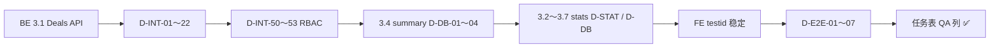

# QA 测试计划 — Phase 3 商机 Pipeline 与仪表盘

**子任务 ID**：`3.1`–`3.7`、`3.UI`、`3.E2E`（`[QA]` 轨）  
**测试日期**：待执行  
**测试人**：待填  
**输入**：[phase-3-deals-dashboard-prd.md](../prd/phase-3-deals-dashboard-prd.md) · [phase-3-deals-dashboard-api.md](../api/phase-3-deals-dashboard-api.md) v1.0 · [04-phase-3-deals-dashboard-schema.md](../architecture/04-phase-3-deals-dashboard-schema.md) · [phase-3-notes.md](../meeting-notes/phase-3-notes.md) §2b  
**关联任务**：[00-mvp-task-breakdown.md](../tasks/00-mvp-task-breakdown.md) § Phase 3 并行表

---

## 1. 测试范围

### 1.1 本计划覆盖（Phase 3 QA Done 条件）

| 子任务 | 类别 | 内容 |
|--------|------|------|
| **3.1** | API 集成测 | Deals CRUD；`GET /api/deals/pipeline`；`PUT /api/deals/:id/stage`；阶段状态机；租户隔离；`deals:*` RBAC |
| **3.2–3.3** | API 集成测 | `GET /api/deals/stats/by-stage`、`win-rate`；数据范围与列表一致 |
| **3.4** | API 集成测 | `GET /api/dashboard/summary`；`data_scope`；禁止跨租户 KPI 泄漏 |
| **3.5** | API 集成测 | `GET /api/dashboard/quota`；`completion_rate` 与 seed 一致 |
| **3.6** | API 集成测 | `GET /api/dashboard/funnel`；与 pipeline 计数同源权限 |
| **3.7** | API 集成测 | `GET /api/dashboard/team-ranking`；仅 `department`/`all` scope |
| **3.UI** | 组件冒烟（可选） | `ChartSparkline`、`ChartGauge` Vitest + `/charts` 案例页 |
| **3.E2E** | Playwright | `phase3-deals` + Dashboard 冒烟；`data-testid` 对齐 §6 |
| **契约** | 全 Phase | `{ code, message, data, pagination? }`；禁止 body `tenant_id`；只读字段不可写 |
| **审计** | 抽测 | `deal.create`、`deal.stage_change`、`deal.convert_from_lead` |
| **Convert 扩展** | 集成测 | `POST /api/leads/:id/convert` + `create_deal` → `deal_id`（Should，3.1 后） |

### 1.2 不在 Phase 3（登记占位）

| 内容 | 说明 |
|------|------|
| `GET /api/deals/stats/velocity` | API 标记 Could；不测 |
| `GET /api/dashboard/todo` | Could；FE fixture 可保留 |
| 关系降温名单（PRD §4.6） | Should；规则版单测归 FE/BE 后续 PR |
| 自定义 Pipeline 阶段、多币种、审批流 | Won't |
| Phase 4 i18n 全量审计 | Phase 3 仅 Deals/Dashboard 关键路径双语 |

### 1.3 前置与环境

| 项 | 要求 |
|----|------|
| BE | 迁移 `00008_phase3_deals.sql` + `00009_*` 权限种子；Deals/Dashboard 路由注册 |
| FE | `/deals`、`/deals/[id]`、`/` Dashboard；§6 `data-testid` |
| 账号 | Demo `admin@demo.com` / `password123`；**另需** `sales_a`、`sales_b`、`manager`、`viewer`（复用 Phase 2 种子或 3.x 迁移补充） |
| 配额 | `tenants.config.sales_quota` 在 seed 中设非 0，否则 Gauge 仅测空态 |
| 命令 | `cd backend && go test ./internal/interfaces/http/... -run 'DealsHTTP\|DashboardHTTP'`；`cd e2e && npm test -- tests/phase3-deals.spec.ts`（待建） |
| 技术债 | [phase-1-qa.md](./phase-1-qa.md) Bug #3：新租户 Casbin — **不阻塞** Demo Admin 单接口 CRUD；**阻塞** Sales/Manager 越权矩阵全绿 |

---

## 2. PRD / 契约 → 验收追溯

| PRD / 契约要点 | 验收标准摘要 | 测试 ID |
|----------------|--------------|---------|
| DL-01～04 Deals CRUD | 创建/读/改/删/筛选 | D-INT-01～05 |
| PL-01～04 Pipeline | pipeline 分列；漏斗 count/amount | D-INT-10～12 |
| 阶段状态机 §2.1 | 合法/非法迁移；终态只读 | D-INT-20～22 |
| DL-05 convert + deal | `create_deal` → `deal_id` | D-INT-30 |
| DS-01～03 统计 | by-stage、win-rate 与 scope | D-STAT-01～05 |
| DB-01～02 summary | 一次加载 KPI + sparklines | D-DB-01～04 |
| QT-01～02 配额 | Gauge 数据一致 | D-DB-05 |
| 经理排行 §4.4.4 | team-ranking scope | D-DB-06 |
| §5 多租户 | 跨租户 404；Dashboard 无泄漏 | D-INT-40～41 |
| §5 RBAC | Sales 本人；Manager all | D-INT-50～53 |
| §8 E2E 路径 | 建商机→改阶段→漏斗；经理/销售隔离 | D-E2E-01～06 |
| 图表 Done | ≥4 类图接 API | D-E2E-07、§9 |
| PRD §7 性能 | summary P95 &lt; 300ms（本地种子） | D-PERF-01 |

---

## 3. 测试数据与角色

### 3.1 建议种子（BE `00009_seed_phase3_deals_demo.sql` 或测试 helper）

| 角色 | 邮箱建议 | `data_scope` | `deals` 权限 |
|------|----------|--------------|--------------|
| `sales_a` | `sales-a@demo.com` | `self` | view, create, update（无 delete 可选） |
| `sales_b` | `sales-b@demo.com` | `self` | 同上 |
| `manager` | `manager@demo.com` | `all` | view, create, update, delete |
| `viewer` | `viewer@demo.com` | `self` | view only |

每个销售至少 2 条 **本人** `owner_id` 商机（不同阶段）；`sales_b` 商机对 `sales_a` 不可见。经理可见 A+B 合计 ≥ 4 条 open deal。

**配额 seed**（Demo 租户）：

```json
{
  "sales_quota": { "amount": 5000000, "currency": "CNY", "period": "2026-05" }
}
```

`won_amount_mtd` 由 1～2 条 `stage=won` 且 `closed_at` 在本月的 Deal 构成，便于 `completion_rate` 断言。

### 3.2 标准 Deal 载荷（集成测）

```json
{
  "title": "QA Deal 北辰物流年度合作",
  "stage": "qualification",
  "amount": 280000,
  "currency": "CNY",
  "probability": 40,
  "expected_close_date": "2026-07-15",
  "tags": ["qa", "phase3"]
}
```

### 3.3 阶段迁移矩阵（集成测必跑）

| 从 \ 到 | proposal | negotiation | won | lost | qualification |
|---------|----------|-------------|-----|------|-----------------|
| **qualification** | ✅ | ⬜ 跳过直连按实现 | ❌ | ❌ | — |
| **proposal** | — | ✅ | ❌ | ✅ | ✅ 回退 |
| **negotiation** | ✅ 回退 | — | ✅ + `closed_at` | ✅ + `lost_reason` 建议 | ✅ 回退 |
| **won** | ❌ 终态 | ❌ | — | ❌ | ❌ |
| **lost** | ❌ 终态 | ❌ | ❌ | — | ❌ |

非法迁移：`HTTP 400`，`message` 含 `invalid_stage_transition`。终态再 `PUT .../stage` → `deal_closed_readonly`（契约 §8）。

---

## 4. Deals API 集成测试用例（3.1）

**建议文件**：`backend/internal/interfaces/http/deals_integration_test.go`  
**运行**：`cd backend && go test ./internal/interfaces/http/... -run DealsHTTP -count=1`  
**模式**：httptest + 测试 DB；`Authorization` + `X-Tenant-ID`。

| ID | 场景 | 步骤 | 预期 |
|----|------|------|------|
| D-INT-01 | 创建 | `POST /api/deals` 合法 body | `200/201`，`data.id` UUID，`tenant_id` 当前租户，`owner_id` 默认当前用户 |
| D-INT-02 | 列表分页 | `GET /api/deals?page=1&page_size=20` | `pagination` 存在；仅本租户 + scope |
| D-INT-03 | 搜索/筛选 | `?search=北辰&stage=qualification&min_amount=100000` | 结果匹配 Query |
| D-INT-04 | 详情/更新/删 | `GET` → `PATCH` amount → `DELETE` → `GET` | 更新生效；删除后 404 或软删不可见 |
| D-INT-05 | 只读字段 | PATCH `engagement_score: 99` | 忽略或 400；DB 仍为系统值 |
| D-INT-10 | Pipeline | `GET /api/deals/pipeline` | `stages[]` 含五阶段 code；`summary.open_count` ≥ 0 |
| D-INT-11 | Pipeline 权限 | sales_a pipeline | 不含 sales_b 的 deal id |
| D-INT-12 | Pipeline metric | `?metric=amount`（若支持） | 漏斗 amount 与 items 一致 |
| D-INT-20 | 阶段变更 | `PUT /api/deals/:id/stage` proposal→negotiation | 200；`audit_logs.action=deal.stage_change` |
| D-INT-21 | 非法迁移 | qualification→won（跳过） | 400 + `invalid_stage_transition` |
| D-INT-22 | 终态 | won 后再 PUT stage | 400 + `deal_closed_readonly` |
| D-INT-30 | convert+deal | qualified lead + convert `create_deal` | 响应 `deal_id`；Deal.`lead_id` 匹配；`deal.convert_from_lead` |
| D-INT-50 | Sales 越权读 | A token `GET /api/deals/:id`（B 的 id） | 403 或 404 |
| D-INT-51 | Sales 越权改 | A 改 B 的 stage | 403 |
| D-INT-52 | viewer 无 create | viewer `POST /api/deals` | 403 |
| D-INT-53 | Manager 全量 | manager `GET /api/deals` | 含 A、B 条数 |
| D-INT-40 | 跨租户 | Tenant-A token + Tenant-B `X-Tenant-ID` | 403 或空 |
| D-INT-41 | 无租户头 | 缺 `X-Tenant-ID` | 401/400 |
| D-INT-60 | 参数校验 | `title` 空、`stage=invalid`、`amount=-1` | 400 |
| D-INT-61 | SQL 注入 | `search=' OR 1=1--` | 无异常泄漏 |
| D-INT-62 | XSS 存储 | title `<script>alert(1)</script>` | 存原文；API 不执行 |

**域单测（可选）**：`backend/internal/application/deal/stage_test.go` — 状态机表与 §3.3 矩阵一致。

---

## 5. Deals 统计 API 集成测试（3.2–3.3）

**建议文件**：`backend/internal/interfaces/http/deals_stats_integration_test.go`  
**运行**：`-run DealsHTTP_Stats`

| ID | 场景 | 步骤 | 预期 |
|----|------|------|------|
| D-STAT-01 | by-stage | `GET /api/deals/stats/by-stage` | `items[].label` 为 stage code；`total` 与 scope 内列表 stage 分布一致 |
| D-STAT-02 | by-stage amount | `metric=amount` | 各 stage `amount` 之和 ≈ open deals 金额和（允许 closed 排除规则与实现一致） |
| D-STAT-03 | win-rate | `GET .../stats/win-rate?granularity=month` | `items[].rate` = won/(won+lost)；分母 0 时期 `rate` null |
| D-STAT-04 | 日期非法 | `to < from` | 400 |
| D-STAT-05 | 租户隔离 | 跨租户 stats | total=0 或 403 |
| D-STAT-06 | 权限 | viewer 无 `deals:view` | 403（与 list 一致） |
| D-STAT-07 | scope | sales_a stats total ≤ manager 同 Query | owner scope 与 list 同源 |

---

## 6. Dashboard API 集成测试（3.4–3.7）

**建议文件**：`backend/internal/interfaces/http/dashboard_integration_test.go`  
**运行**：`-run DashboardHTTP`

| ID | 子任务 | 场景 | 预期 |
|----|--------|------|------|
| D-DB-01 | 3.4 | `GET /api/dashboard/summary` | `kpis`、`sparklines`（7 点）、`data_scope` 与 JWT 角色一致 |
| D-DB-02 | 3.4 | sales_a summary | `deals_total` 仅本人；不含 B 的商机计数 |
| D-DB-03 | 3.4 | manager summary | `deals_open_amount` ≥ A+B open 之和（种子下） |
| D-DB-04 | 3.4 | 跨租户 summary | Tenant-B KPI 全 0 或 403 |
| D-DB-05 | 3.5 | `GET /api/dashboard/quota` | `completion_rate` = `won_amount_mtd/target_amount`（±0.01） |
| D-DB-06 | 3.7 | `GET /api/dashboard/team-ranking` | manager 200 + `items[].rank`；sales_a 403 或空（无 view_all） |
| D-DB-07 | 3.6 | `GET /api/dashboard/funnel?scope=deals` | `stages[].count` 与 pipeline 汇总一致（同 scope） |
| D-DB-08 | 3.6 | `scope=leads` | 与 Leads 漏斗定义一致（回归 Phase 2） |
| D-DB-09 | — | 无 `dashboard:view` | 403 `dashboard_scope_denied`（种子后） |
| D-DB-10 | — | 无 token | 401 |

---

## 7. E2E 测试用例（3.E2E · Playwright）

**建议文件**：`e2e/tests/phase3-deals.spec.ts`（Deals）；`e2e/tests/phase3-dashboard.spec.ts`（Dashboard，可合并单 spec）  
**前置**：backend + web 已起；`manager@demo.com` 测全量；`sales-a@demo.com` 测隔离。

| ID | 场景 | 步骤 | 预期 | testid / 路由 |
|----|------|------|------|----------------|
| D-E2E-01 | Pipeline 冒烟 | 登录 → `/deals` | 看板或空态；`deals-pipeline` 可见 | `deals-pipeline` |
| D-E2E-02 | 新建商机 | `deal-create-btn` → 填标题/金额 → 保存 | 看板对应列出现卡片 | `deal-create-btn` |
| D-E2E-03 | 改阶段 | 拖拽或菜单 proposal→negotiation | UI 与刷新后 API 一致 | `deals-pipeline-stage-{stage}` |
| D-E2E-04 | convert 链路 | Lead 详情 convert + 勾选创建商机 | 跳转 `/deals/:id`；详情有 lead 链接 | 待 FE testid |
| D-E2E-05 | 权限 UI | `sales_a` 不见 B 的 deal 标题 | 看板/列表无泄漏 | — |
| D-E2E-06 | Dashboard summary | 登录 `/` | 一次 network 含 `dashboard/summary`；KPI 非全 0（种子下） | `dashboard-kpi-row` |
| D-E2E-07 | 图表 Done | Dashboard 页 | Sparkline + Line + Funnel + Gauge 至少 4 类无长期 skeleton | `dashboard-quota-gauge` |
| D-E2E-08 | 经理排行 | manager 见 team ranking 区块；sales 不可见 | 与 D-DB-06 一致 | 待 FE：`dashboard-team-ranking` |
| D-E2E-09 | i18n | `/deals`、/` 切换 zh/en | 阶段 label、KPI 无裸 key | — |
| D-E2E-10 | Zone E 无 Preview | Demo `/` 迷你漏斗 | 无 Preview 角标（真实 `dashboard/funnel`） | — |

**同步检查点**：FE 合入 §8 testid 后再启用 D-E2E-02/03 硬性断言。

---

## 8. `data-testid` 约定（与 FE 对齐）

| 元素 | testid | 子任务 | 状态 |
|------|--------|--------|------|
| 新建商机 | `deal-create-btn` | 3.1 | 已约定 |
| Pipeline 看板 | `deals-pipeline` | 3.1 | 已约定 |
| 阶段列 | `deals-pipeline-stage-{stage}` | 3.1 | 已约定 |
| Dashboard KPI 行 | `dashboard-kpi-row` | 3.4 | 已约定 |
| 配额仪表 | `dashboard-quota-gauge` | 3.5 | 已约定 |
| **建议新增** | `deal-form-title`、`deal-form-submit`、`deal-stage-menu`、`deals-tab-pipeline`、`deals-tab-analytics` | 3.1 | 待 FE |
| **建议新增** | `dashboard-team-ranking`、`dashboard-funnel-chart` | 3.6–3.7 | 待 FE |

---

## 9. ui-kit 组件测试（3.UI · 可选 Must for 图表 Done）

| ID | 组件 | 验证 |
|----|------|------|
| D-UI-01 | `ChartSparkline` | Vitest：props `series` 7 点渲染；`/charts` 案例可见 |
| D-UI-02 | `ChartGauge` | Vitest：`value` 0–100 与超额 &gt;100；i18n 中心文案 |
| D-UI-03 | 主题 | 明暗切换图表颜色不崩（可复用 `charts-theme.spec.ts` 模式） |

---

## 10. 安全 / i18n / 非功能（抽测）

| ID | 类型 | 说明 |
|----|------|------|
| D-SEC-01 | 认证 | 无 token → `/api/deals`、`/api/dashboard/summary` → 401 |
| D-SEC-02 | IDOR | 见 D-INT-50、D-INT-40 |
| D-I18N-01 | 文案 | `/deals`、Dashboard KPI、Gauge 双语键存在 |
| D-PERF-01 | summary | 本地种子 `GET /api/dashboard/summary` P95 &lt; 300ms |
| D-PERF-02 | pipeline | `GET /api/deals/pipeline` P95 &lt; 500ms（每阶段 ≤20 items） |

---

## 11. 子任务与任务表勾选映射

| 任务 ID | QA 通过条件（勾选 `[QA]` 列前） |
|---------|--------------------------------|
| 3.1 | §4 Must：D-INT-01～05、10～12、20～22、50～53、40～41 |
| 3.2–3.3 | §5：D-STAT-01～07 |
| 3.4 | §6：D-DB-01～04 |
| 3.5 | §6：D-DB-05 + D-E2E-07 Gauge |
| 3.6 | §6：D-DB-07～08 + D-E2E-07 漏斗图 |
| 3.7 | §6：D-DB-06 + D-E2E-08 |
| 3.UI | §9 D-UI-01～02（或与 FE 联合验收图表 Done） |
| 3.E2E | §7 D-E2E-01～07 Must；08～10 Should |

**业务汇总行**（PM）：全部 Must 子任务 QA ✅ 且 PRD §8 图表 Done 勾选后，由 PM 勾选任务表「业务」汇总，**QA 不擅自勾选**。

---

## 12. 执行顺序



| 入口 | 条件 |
|------|------|
| 开始 Deals 集成测 | `POST /api/deals` 本地 200 |
| 开始 Dashboard 集成测 | `GET /api/dashboard/summary` 可用 |
| 开始 E2E | `deal-create-btn`、`deals-pipeline` 已合入 |
| **Phase 3 QA 计划评审通过** | 本文档已链入 `docs/qa/README.md` |
| **3.1 QA 关闭** | §4 Must 绿；无 P0/P1 |
| **Phase 3 全轨关闭** | §11 表全部 Must 行绿 + §7 D-E2E-01～07 |

---

## 13. 自动化落点（实现时创建）

| 类型 | 路径 |
|------|------|
| Go Deals 集成测 | `backend/internal/interfaces/http/deals_integration_test.go` |
| Go Deals 统计 | `backend/internal/interfaces/http/deals_stats_integration_test.go` |
| Go Dashboard | `backend/internal/interfaces/http/dashboard_integration_test.go` |
| 阶段机单测 | `backend/internal/application/deal/stage_test.go` |
| Playwright | `e2e/tests/phase3-deals.spec.ts`、`e2e/tests/phase3-dashboard.spec.ts` |
| 登录辅助 | `e2e/tests/helpers/demo-session.ts`（复用） |
| ui-kit Vitest | `packages/ui-kit/src/components/ui/chart/chart-sparkline.spec.ts` 等 |

**Makefile / 命令**：

```bash
cd backend && go test ./internal/interfaces/http/... -run 'DealsHTTP|DashboardHTTP' -count=1
cd e2e && npm test -- tests/phase3-deals.spec.ts tests/phase3-dashboard.spec.ts
```

---

## 14. Bug 记录

| 序号 | 描述 | 严重程度 | 状态 | 关联子任务 |
|------|------|----------|------|------------|
| — | （执行后填写） | | | |

---

## 15. 测试结论

**状态**：⬜ 未执行（计划已评审）

**正式关闭 Phase 3 `[QA]` 列（逐行）条件**：

- [ ] 本文档 §4–§6 对应子任务 Must ID 已实现且本地/CI 通过  
- [ ] §7 D-E2E-01～07 通过  
- [ ] [00-mvp-task-breakdown.md](../tasks/00-mvp-task-breakdown.md) 表 `3.1`–`3.7`、`3.UI`、`3.E2E` 的 `[QA]` 列按 §11 分别改 `✅`  
- [ ] 无 P0/P1；P2 记入 §14  

**说明**：Phase 3 执行报告（测通/不测通明细）可在全轨结束后另写 `phase-3-qa.md`（从 [qa-test-template.md](../templates/qa-test-template.md) 复制），本文件保持**计划 + 用例 ID** 不变。

---

## 修订记录

| 日期 | 说明 |
|------|------|
| 2026-05-25 | 首版：Phase 3 Deals + Dashboard 集成测 / E2E / 子任务映射，对齐 PRD v0.1 与 API v1.0 Accepted |
